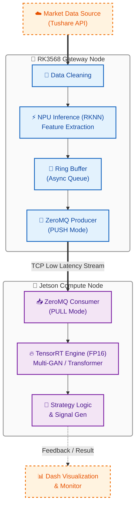
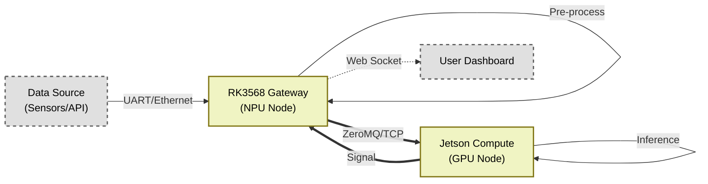

# HEQIS 🚀

**Heterogeneous Edge Quant Inference System**
**基于异构边缘集群的高性能量化交易推理系统**



## 📖 项目简介 (Introduction)

**HEQIS** (Heterogeneous Edge Quant Inference System) 是一个面向下一代边缘计算场景的分布式量化推理系统。

本项目旨在解决复杂深度学习模型（Multi-GAN, Transformer）在资源受限边缘设备上难以实时部署的痛点。通过构建 **RK3568 (Gateway/NPU) + Jetson Nano (Compute/GPU)** 的双机异构集群，HEQIS 实现了算力的分级调度与极致优化。

系统集成了从数据清洗、多智能体对抗训练、策略回测到 **端侧分布式部署** 的全链路工程，支持利用 **ZeroMQ** 搭建低延迟通信链路，并通过 **RKNN** 与 **TensorRT** 充分压榨异构硬件性能，实现毫秒级决策响应。

## ✨ 核心特性 (Key Features)

### 🏗️ 分布式异构架构 (System Infra)
*   **双机协同调度**：
    *   **Gateway Node (RK3568)**: 负责数据接入、预处理及轻量级推理，通过 **ZeroMQ** 异步链路分发任务。
    *   **Compute Node (Jetson)**: 负责承载重型计算任务，利用 CUDA 核心进行并行加速。
*   **极致性能优化**：
    *   **异步流水线 (Asynchronous Pipeline)**: 设计环形缓冲区 (Ring Buffer) 解耦数据接收与推理，掩盖网络通信延迟。
    *   **硬件亲和性 (Hardware Affinity)**: 利用 `taskset` 绑定 NPU 核心减少上下文切换；引入 **Numba JIT** 消除 Python GIL 瓶颈。
    *   **双端加速**: RK3568 端打通 RKNN 全流程；Jetson 端基于 TensorRT 实现 FP16 精度量化。

### 🎯 算力调度策略 (Workload Partitioning)
本项目的核心设计思想在于将计算任务合理地拆分到最适合的硬件单元上，实现 `1+1 > 2` 的效果。

| 硬件节点     | 承担任务                                       | 技术原因                                                                                   |
| :----------- | :--------------------------------------------- | :----------------------------------------------------------------------------------------- |
| **RK3568**   | 1. 数据清洗 & 归一化 (CPU) <br> 2. **技术指标计算 (NPU)** <br> 3. 轻量级特征提取 (NPU) | 任务模式固定 (等效于1D卷积)，可**量化为INT8**，完美适配NPU原生算子，实现极致**能效比**。  |
| **Jetson**   | 1. **Transformer + RoPE (GPU)** <br> 2. **Multi-GAN 博弈 (GPU)** <br> 3. VAE 模块推理 (GPU) | **算子非标(RoPE)**，避免CPU回落风险；**精度敏感(GAN)**，必须使用FP16；依赖成熟**CUDA生态**。 |

### ⚡ 性能价值：加速策略研究与迭代
本系统的高性能并非仅为实时交易设计，其核心价值在于**大幅缩短策略研究的周期**：
*   **高通量回测:** 利用 NPU/GPU 加速，可将数年历史数据的回测时间从 **“天”级缩短至“小时”级**。
*   **快速参数寻优:** 使得在可接受时间内完成大规模超参数搜索成为可能，从而找到最优模型。
*   **架构前瞻性:** 系统原生支持毫秒级响应，为未来无缝迁移至分钟级或Tick级实时交易场景预留了技术储备。

### 🧠 算法模型 (Algorithmic Intelligence)
*   **Multi-GAN 博弈框架**: 引入多生成器与多判别器对抗训练，解决金融时序数据的非平稳性问题。
*   **时序特征增强**: 集成 **RoPE (旋转位置编码)** 增强长序列捕捉能力；内置 **CAE/t3-VAE** 无监督模块提取潜在市场因子。
*   **鲁棒策略回测**: 内置实战级风控规则（涨跌停过滤、滑点模拟），自动评选最优策略 (G1/G2/G3)。

### 📊 全栈交互 (Interactive UI)
*   **Dash 决策大屏**: 提供 K 线复盘、买卖信号可视化及模型性能监控。
*   **自动化数据流**: 集成 Tushare Pro，一键完成清洗、归一化及技术指标（MACD/KDJ/MA）计算。

---

## 🛠️ 硬件拓扑与环境 (Topology)

### 硬件架构


### 开发环境依赖
*   **Host (训练端)**: Windows 10/11 + NVIDIA GPU (RTX 3060+)
    *   Python 3.11, PyTorch 2.1.2+cu118
*   **Edge Node 1 (RK3568)**: Ubuntu 20.04 / Buildroot
    *   rknn-toolkit2-lite, python-rknnlite
*   **Edge Node 2 (Jetson)**: JetPack 4.6+ / Ubuntu 18.04
    *   TensorRT 8.x, PyTorch-GPU, ZeroMQ (`pyzmq`)

---

## 🚀 快速开始 (Quick Start)

### 1. 数据准备
配置 `标的参考.txt` 并获取 Tushare 数据。
```bash
python get_stock_data.py
```

### 2. 模型训练
启动多智能体对抗训练（包含预训练与主训练）。
```bash
python experiment_runner.py --mode train --num_epochs 100
```

### 3. 策略回测
筛选表现最佳的生成器策略，生成 `best_metrics.csv`。
```bash
python filter_trading_signals.py
```

### 4. 启动可视化
在本地查看训练结果与策略表现。
```bash
python dash_kline_visualizer.py
```

---

## 💾 边缘端部署流程 (Deployment)

本系统核心在于将训练好的模型部署至 **异构边缘集群**。

### Phase 1: 模型导出 (Windows)
使用部署工具将 PyTorch 模型转换为中间格式 (ONNX) 并解耦预处理参数。
```bash
python deploy_export.py --target all
```
*产出：`deploy_output/` 包含 `model_gan.onnx`, `scaler_params.json`*

### Phase 2: 模型转换与量化
*   **For RK3568 (NPU)**: 使用 `rknn-toolkit2` 将轻量级特征提取模型转为 `.rknn` (FP16)。
*   **For Jetson (GPU)**: 使用 `trtexec` 或 Python API 将计算密集型模型转为 `.engine` (FP16)。
    ```bash
    # 示例：Jetson端转换
    trtexec --onnx=model_gan.onnx --saveEngine=model_gan_fp16.engine --fp16
    ```

### Phase 3: 分布式推理启动
1.  **启动 Jetson 计算节点** (Consumer):
    ```bash
    python edge_compute_node.py --port 5555 --engine model_gan_fp16.engine
    ```
2.  **启动 RK3568 网关节点** (Producer):
    ```bash
    python edge_gateway.py --target_ip <JETSON_IP> --port 5555
    ```
*此时，RK3568 将通过 ZeroMQ 将预处理后的 Tensor 流式传输至 Jetson，并实时接收返回的交易信号。*

---

## 📂 目录结构

```text
HEQIS/
├── csv_data/                # 存放原始及预处理后的股票数据
├── output/                  # 训练日志、权重检查点 (Checkpoints)
├── output_filtered_signals/ # 回测结果、最佳策略指标 (best_metrics.csv)
├── models/                  # 模型定义 (Multi-GAN, Transformer, RoPE, VAE等)
├── utils/                   # 通用工具类 (Logger, Trainer, Visualization)
├── infra/                   # [新增] 边缘计算与异构通信模块
│   ├── zmq_utils/           # ZeroMQ 通信协议封装
│   ├── rknn_inference/      # RK3568 NPU 推理接口
│   └── trt_inference/       # Jetson TensorRT 推理接口
├── deploy_output/           # 导出的部署文件 (ONNX/JSON/RKNN)
├── get_stock_data.py        # 数据获取与清洗脚本
├── experiment_runner.py     # 训练主程序入口
├── filter_trading_signals.py# 策略回测与筛选入口
├── dash_kline_visualizer.py # 可视化决策大屏
├── deploy_export.py         # 部署文件导出工具 (Batch版)
├── deploy_convert_batch.py  # 模型转换脚本 (ONNX -> RKNN/Engine)
├── edge_gateway.py          # [端侧] RK3568 网关主程序 (Producer)
├── edge_compute_node.py     # [端侧] Jetson 计算节点主程序 (Consumer)
└── README.md                # 项目说明文档
```

## ⚠️ 免责声明

本项目仅供 **计算机系统架构研究**、**边缘计算性能验证** 及 **深度学习算法实验** 使用。
项目中的任何预测结果、信号或策略均不构成投资建议。实盘交易风险巨大，请自行承担风险。

---

## 🤝 贡献与支持

Welcome PRs! 特别欢迎关于 **CUDA 算子优化**、**RKNN 异构调度** 及 **ZeroMQ 通信效率提升** 的改进建议。
