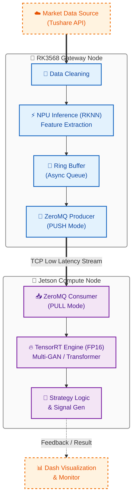

# HEQIS 🚀

**Heterogeneous Edge Quant Inference System**
**基于异构边缘集群的高性能量化交易推理系统**



## 📖 项目简介 (Introduction)

**HEQIS** (Heterogeneous Edge Quant Inference System) 是一个面向下一代边缘计算场景的分布式量化推理系统。

本项目旨在解决复杂深度学习模型（Multi-GAN, Transformer）在资源受限边缘设备上难以实时部署的痛点。通过构建 **RK3568 (I/O & System Supervisor) + Jetson Orin Nano (AI Compute Brain)** 的工业级主从架构，HEQIS 实现了算力的分级调度与极致优化。

系统集成了从数据清洗、多智能体对抗训练、策略回测到 **端侧分布式部署** 的全链路工程，支持利用 **ZeroMQ** 搭建低延迟通信链路，并通过 **RKNN** 与 **TensorRT** 充分压榨异构硬件性能，实现毫秒级决策响应。

## 🤔 项目背后的战略思考：从“算法淘金”到“卖铲子”
(Strategic Rationale: From Gold Rush to Selling Shovels)

表面上看，这是一个关于“量化交易”的项目。但其内核，是我**对于未来技术趋势和个人定位的战略判断**。就像炒股一样，当你身边平时不炒股的亲戚、朋友开始炒股，当菜市场的大爷大妈都开始讨论牛市的时候，往往是**牛市见顶**的信号。当前**AI算法岗**的热度与讨论度已然如此，人才的“通货膨胀”正在发生。

因此，我选择避开这条人尽皆知的道路。在AI算法的“淘金热”中，与其涌向“挖矿”（研究新模型），我选择成为那个“卖铲子和”的人。因为我坚信，#“**算法的最终价值由落地决定**”，而产业的核心瓶颈已从“缺乏好算法”转变为“缺乏能将算法产品化的工程师”。本项目就是我对这一“工程落地”问题的完整回答。

1.  **价值的最后一公里：从“模型”到“产品” (The Last Mile of Value: From "Model" to "Product")**
    *   **行业现状**: 大量的AI研究成果停留在论文或云端Jupyter Notebook中。一个模型在云端能跑到99%的精度，但在延迟、功耗、成本的约束下，无法部署到实际设备上，其商业价值就等于零。**算法的价值，最终由落地能力决定。**
    *   **我的预判**: 未来十年，产业的核心瓶颈将不再是“缺乏好算法”，而是“缺乏能将算法产品化的工程师”。因此，我选择深耕**AI Infra与部署**，专注于打通AI价值的“最后一公里”，将理论模型转化为可靠的工业级产品。

2.  **构建核心壁垒：从“挥剑”到“铸剑” (Building a Moat: From Wielding to Forging the Sword)**
    *   **行业现状**: 许多算法工作如同“挥剑”，依赖于成熟框架进行“调参”，虽能克敌，但剑非己出。真正的技术壁垒在于底层：**如何为各式各样的“剑”（算法模型）打造最锋利的“剑鞘”与“手臂”（运行环境）**。这需要驾驭异构硬件、编写高性能算子、设计健壮系统架构的“铸剑”能力。
    *   **我的目标**: 当算法本身逐渐“商品化”，真正的“铸剑师”将拥有定价权。本项目就是我从一个“挥剑者”向“铸剑师”转变的实践。通过深度应用TensorRT/RKNN，设计异构调度流水线，我致力于构建自己的硬核技术壁垒。

3.  **终极场景的挑战：以“造火箭”的标准，锤炼“造汽车”的技术 (The Ultimate Challenge: Building Rockets to Learn How to Build Cars)**
    *   **场景特性**: 量化交易场景对系统的要求，完美地暴露了纯算法思维的短板，并放大了工程落地的重要性：
        *   **极致低延迟 (Ultra-Low Latency)**: 市场瞬息万变，决策必须在毫秒内完成。
        *   **数据高通量 (High-Throughput Data)**: 需要同时处理多源、高频的数据流。
        *   **7x24小时高可靠 (Extreme Reliability)**: 任何微小的系统崩溃都可能导致巨大损失。
        *   **复杂算法模型 (Complex Models)**: 需要依赖复杂的时序模型才能捕捉微弱信号。
    *   **我的目的**: 我选择量化交易，正是因为它对系统的苛刻要求。我相信，**如果一个系统架构能够承受住“造火箭”（高频量化）的极端挑战，那么将它降维应用到“造汽车”（工业质检、机器人、自动驾驶感知）等任何其他边缘AI场景，都将游刃有余。** 这是一次以终为始的技术锤炼。

#### 补充类比：战争中的“军火商”
如果将AI行业的竞争比作一场战争：
*   **算法科学家**就像是**一线尖刀部队**，他们负责攻占下一个山头（SOTA模型），但战局瞬息万变，今天的主流战术（模型架构）明天可能就被颠覆，风险极高。
*   而**AI Infra与部署工程师**，则扮演着**军火商**的角色。我们不上前线，但为所有部队提供最关键的装备（高性能推理引擎、稳定的系统框架、低延迟通信链路）。无论前线战术如何变化，对精良“武器”的需求是永恒的。**军火商不参与单一战役的胜负，却能从整场战争的持续中稳定获益，并掌握着定义战争形态的底层能力。** 这正是我所追求的职业生态位。

**综上所述，HEQIS项目是我职业战略的一次集中体现：主动避开算法研究的红海，聚焦于价值更高、壁垒更深、需求更刚性的“AI工程落地”蓝海。它以最严苛的应用场景为目标，倒逼我去掌握和融合分布式系统设计、底层硬件优化、高性能AI部署等一系列解决实际问题的关键技术栈。**

## ✨ 核心特性 (Key Features)

### 🏗️ 分布式异构架构：从“算力卸载”到“功能分离”
本项目采用 **RK3568 (I/O & System Supervisor) + Jetson Orin Nano (AI Compute Brain)** 的工业级主从架构。
*   **AI Brain (Jetson Orin Nano)**: 专职负责所有重型计算任务，包括数据预处理和多模型并行推理，利用其 40 TOPS 的澎湃算力实现极致 AI 性能。
*   **I/O Supervisor (RK3568)**: 作为高可靠的系统总管，专职负责多源数据聚合、协议转换、系统健康监控（Watchdog）及决策持久化，为“大脑”提供稳定、干净的数据流并保障系统7x24小时运行。

### 🎯 算力调度策略 (Workload Partitioning)
新架构的核心是“关注点分离”，让每个硬件单元都做自己最擅长的事。

| 硬件节点     | 承担任务                                       | 技术原因                                                                                   |
| :----------- | :--------------------------------------------- | :----------------------------------------------------------------------------------------- |
| **RK3568**   | 1. **多源数据聚合 & 时间戳对齐** <br> 2. **协议网关 (如Modbus)** <br> 3. **系统健康监控 (Watchdog)** | **高可靠 I/O 与实时性**：利用丰富的工业接口，保证数据采集的**确定性**，避免被 AI 任务抢占资源，并能物理重启计算节点，确保系统鲁棒性。  |
| **Jetson Orin** | 1. **全部数据预处理 (技术指标)** <br> 2. **全部 AI 模型推理 (Transformer/GAN)** <br> 3. **多模型并发** | **极致 AI 性能**：所有计算任务均在 Orin 内部完成，数据不出内存，避免了跨设备传输 Tensor 的延迟瓶颈，充分发挥 Ampere 架构和 DLA 的优势。 |

### ⚡ 性能价值：加速策略研究与迭代
本系统的高性能并非仅为实时交易设计，其核心价值在于**大幅缩短策略研究的周期**：
*   **高通量回测:** 利用 NPU/GPU 加速，可将数年历史数据的回测时间从 **“天”级缩短至“小时”级**。
*   **快速参数寻优:** 使得在可接受时间内完成大规模超参数搜索成为可能，从而找到最优模型。
*   **架构前瞻性:** 系统原生支持毫秒级响应，为未来无缝迁移至分钟级或Tick级实时交易场景预留了技术储备。

### 🧠 算法模型 (Algorithmic Intelligence)
*   **Multi-GAN 博弈框架**: 引入多生成器与多判别器对抗训练，解决金融时序数据的非平稳性问题。
*   **时序特征增强**: 集成 **RoPE (旋转位置编码)** 增强长序列捕捉能力；内置 **CAE/t3-VAE** 无监督模块提取潜在市场因子。
*   **鲁棒策略回测**: 内置实战级风控规则（涨跌停过滤、滑点模拟），自动评选最优策略 (G1/G2/G3)。

### 📊 全栈交互 (Interactive UI)
*   **Dash 决策大屏**: 提供 K 线复盘、买卖信号可视化及模型性能监控。
*   **自动化数据流**: 集成 Tushare Pro，一键完成清洗、归一化及技术指标（MACD/KDJ/MA）计算。

---

## 🛠️ 硬件拓扑与环境 (Topology)

### 硬件架构```mermaid
graph LR
    %% 节点样式定义
    classDef dev fill:#f0f4c3,stroke:#827717,stroke-width:2px,color:#000;
    classDef ext fill:#e0e0e0,stroke:#616161,stroke-width:2px,stroke-dasharray: 5 5,color:#000;

    A["Data Sources<br/>(API/Sensors/PLC)"]:::ext
    B["RK3568 Supervisor<br/>(I/O & Watchdog)"]:::dev
    C["Jetson Orin Nano<br/>(AI Brain)"]:::dev
    D["User Dashboard"]:::ext

    A -->|Multi-protocol| B
    %% 为链接文本加上双引号，避免括号解析错误
    B ==>|"Clean Data (ZeroMQ)"| C
    C ==>|"Decision Signal"| B
    B -->|"Heartbeat"| C
    B -.->|"Web Socket"| D
    B -.->|"Hard Reset"| C
```

### 硬件选型考量 (Hardware Selection Rationale)
本架构的硬件选型是基于“功能分离”、“成本效益”与“战略灵活性”的深度考量，旨在构建一个高可靠且具备未来扩展性的系统。

| 节点角色               | 选型                  | 核心理由                                                                                                                                                             | 替代方案 & 为何不选                                                                                                                                 |
| :--------------------- | :-------------------- | :------------------------------------------------------------------------------------------------------------------------------------------------------------------- | :------------------------------------------------------------------------------------------------------------------------------------------------ |
| **🤖 AI Brain**        | **Jetson Orin Nano**  | **极致 AI 性能**: Ampere 架构 GPU 与 DLA 提供高达 40 TOPS 算力，轻松应对所有重型计算任务。<br>**成熟 CUDA 生态**: TensorRT 工具链完善，算子支持度高，开发与调试效率无与伦比。   | **Jetson Nano**: 性能足够入门，但 Orin 提供了面向未来的算力储备，支持更大、更复杂的模型并行推理。                                                          |
| **🧠 I/O Supervisor** | **RK3568**            | **角色匹配与成本效益**: 四核 A55 CPU 与丰富的 I/O 完美匹配“系统总管”的角色，避免了资源浪费。<br>**低功耗高可靠**: 更低的功耗与散热需求，适合 7x24 小时稳定运行。<br>**战略灵活性**: 自带 1 TOPS NPU 为未来部署“智能看门狗”等轻量级 AI 任务预留了空间。 | **RK3588**: 性能过剩(Overkill)，其强大的 NPU 在此角色中是资源浪费，且破坏了“计算”与“控制”分离的架构纯粹性。<br>**STM32/i.MX6ULL**: 性能太弱，软件栈复杂，在高吞吐量下必然成为瓶颈。<br>**STM32MP257**: 性能尚可，但无 NPU/VPU 等附加值，上限锁死，缺乏扩展性。 |

### 开发环境依赖
*   **Host (训练端)**: Windows 10/11 + NVIDIA GPU (RTX 3060+)
    *   Python 3.11, PyTorch 2.1.2+cu118
*   **Edge Node 1 (RK3568)**: Ubuntu 20.04 / Buildroot
    *   rknn-toolkit2-lite, python-rknnlite
*   **Edge Node 2 (Jetson)**: JetPack 5.x/6.x / Ubuntu 20.04+
    *   TensorRT 8.x, PyTorch-GPU, ZeroMQ (`pyzmq`)

---

## 🚀 快速开始 (Quick Start)

### 1. 数据准备
配置 `标的参考.txt` 并获取 Tushare 数据。
```bash
python get_stock_data.py
```

### 2. 模型训练
启动多智能体对抗训练（包含预训练与主训练）。
```bash
python experiment_runner.py --mode train --num_epochs 100
```

### 3. 策略回测
筛选表现最佳的生成器策略，生成 `best_metrics.csv`。
```bash
python filter_trading_signals.py
```

### 4. 启动可视化
在本地查看训练结果与策略表现。
```bash
python dash_kline_visualizer.py
```

---

## 💾 边缘端部署流程 (Deployment)

本系统核心在于将训练好的模型部署至 **异构边缘集群**。

### Phase 1: 模型导出 (Windows)
使用部署工具将 PyTorch 模型转换为中间格式 (ONNX) 并解耦预处理参数。
```bash
python deploy_export.py --target all
```
*产出：`deploy_output/` 包含 `model_gan.onnx`, `scaler_params.json`*

### Phase 2: 模型转换与量化
*   **For RK3568 (NPU)**: (可选) 使用 `rknn-toolkit2` 转换轻量级监控模型。
*   **For Jetson Orin (GPU/DLA)**: 使用 `trtexec` 或 Python API 将计算密集型模型转为 `.engine` (FP16/INT8)。
    ```bash
    # 示例：Jetson端转换
    trtexec --onnx=model_gan.onnx --saveEngine=model_gan_fp16.engine --fp16
    ```

### Phase 3: 分布式推理启动
1.  **启动 Jetson 计算节点** (AI Brain):
    ```bash
    python edge_compute_node.py --port 5555 --engine model_gan_fp16.engine
    ```
2.  **启动 RK3568 网关节点** (Supervisor):
    ```bash
    python edge_gateway.py --target_ip <JETSON_IP> --port 5555
    ```
    *此时，RK3568 将通过 ZeroMQ 将预处理后的 Tensor 流式传输至 Jetson，并实时接收返回的交易信号。*

---

## 📂 主要目录结构

```text
HEQIS/
├── csv_data/                # 存放原始及预处理后的股票数据
├── output/                  # 训练日志、权重检查点 (Checkpoints)
├── output_filtered_signals/ # 回测结果、最佳策略指标 (best_metrics.csv)
├── models/                  # 模型定义 (Multi-GAN, Transformer, RoPE, VAE等)
├── utils/                   # 通用工具类 (Logger, Trainer, Visualization)
├── infra/                   # [新增] 边缘计算与异构通信模块
│   ├── zmq_utils/           # ZeroMQ 通信协议封装
│   ├── rknn_inference/      # RK3568 NPU 推理接口
│   └── trt_inference/       # Jetson TensorRT 推理接口
├── deploy_output/           # 导出的部署文件 (ONNX/JSON/RKNN)
├── get_stock_data.py        # 数据获取与清洗脚本
├── experiment_runner.py     # 训练主程序入口
├── filter_trading_signals.py# 策略回测与筛选入口
├── dash_kline_visualizer.py # 可视化决策大屏
├── deploy_export.py         # 部署文件导出工具 (Batch版)
├── deploy_convert_batch.py  # 模型转换脚本 (ONNX -> RKNN/Engine)
├── edge_gateway.py          # [端侧] RK3568 网关主程序 (Producer)
├── edge_compute_node.py     # [端侧] Jetson 计算节点主程序 (Consumer)
└── README.md                # 项目说明文档
```

## ⚠️ 免责声明

本项目仅供 **计算机系统架构研究**、**边缘计算性能验证** 及 **深度学习算法实验** 使用。
项目中的任何预测结果、信号或策略均不构成投资建议。实盘交易风险巨大，请自行承担风险。

---

## 🤝 贡献与支持

Welcome PRs! 特别欢迎关于 **CUDA 算子优化**、**RKNN 异构调度** 及 **ZeroMQ 通信效率提升** 的改进建议。
